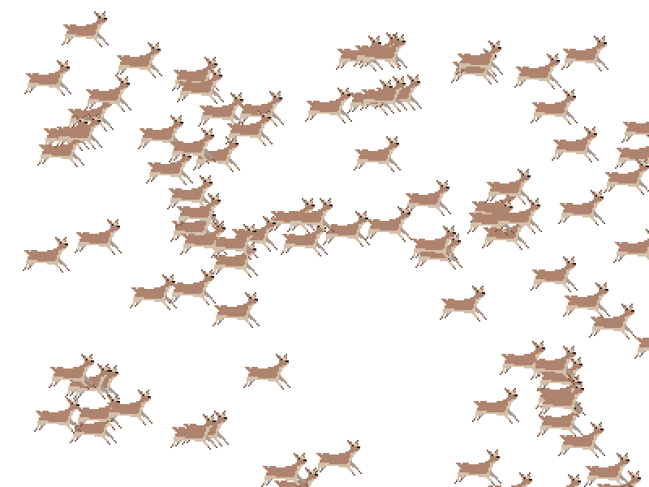

<!-- README.md is generated from README.Rmd. Please edit that file -->

```{r, include = FALSE}
knitr::opts_chunk$set(
  collapse = TRUE,
  comment = "#>",
  fig.path = "man/figures/README-",
  out.width = "100%"
)

library(nara)
library(dplyr)

#~~~~~~~~~~~~~~~~~~~~~~~~~~~~~~~~~~~~~~~~~~~~~~~~~~~~~~~~~~~~~~~~~~~~~~~~~~~~~
# Generate the pkgdown documentation
#~~~~~~~~~~~~~~~~~~~~~~~~~~~~~~~~~~~~~~~~~~~~~~~~~~~~~~~~~~~~~~~~~~~~~~~~~~~~~
if (FALSE) {
  pkgdown::build_site(
    # devel = TRUE,
    override = list(destination = "../coolbutuseless.github.io/package/nara")
  )
}
```

# nara 

<!-- badges: start -->

[](https://github.com/coolbutuseless/nara/actions/workflows/R-CMD-check.yaml)
<!-- badges: end -->

`{nara}` provides tools for working with R's `nativeRaster` image format to 
enable fast double-buffered graphics rendering.

### Why?

`nativeRaster` buffers are fast enough to use for rendering at speed >30 frames-per-second.  
This makes them useful for games and other interactive applications.

### Example 

An example graphics demo is this non-playable version of pacman created and running in R in realtime [(see the vignette)](https://coolbutuseless.github.io/package/nara/articles/pacman.html): 


# Details

`{nara}`:

* is an *off-screen* rendering buffer.
* is fast to render.
* uses *in-place* operations to avoid memory allocations.
* is focussed on rendering discrete pixels, so 
    * no anti-aliasing is done.
    * all dimensions are rounded to integer values prior to rendering.


### What is a `nativeRaster` and why is it fast?


A `nativeRaster` is a built-in datatype in R.

It is an integer matrix where each integer represents the RGBA colour at 
a single pixel.  The 32-bit integer at each location is interpreted within
R to be four colour channels (RGBA) represented by 8 bits each.

This way of encoding colour information is closer to the internal representation
used by graphics devices, and therefore can be faster to render, save and load
(as fewer data conversion steps are needed).

### In-place operation

`{nara}` is targeted at fast rendering (>30fps), and tries to minimise
R function calls and memory allocations.

When updating `nativeRaster` objects with this package, all changes are done
*in place* on the current object i.e. a new object is **not** created.

### Anti-aliasing/Interpolation

No anti-aliasing is done by the draw methods in this package.

No interpolation is done - `x` and `y` values for drawing coordinates are
converted to integers.


## Installation

You can install from [GitHub](https://github.com/coolbutuseless/nara) with:

``` r
# install.package('remotes')
remotes::install_github('coolbutuseless/nara')
```


## Vignettes

* [Pacman demo](https://coolbutuseless.github.io/package/nara/articles/pacman.html)
* [Creating, transforming, reading, writing nativeRaster images](https://coolbutuseless.github.io/package/nara/articles/conversion.html)


## Static Rendering: Example

The following is a rendering of a single scene with multiple elements.

The interesting thing about this scene that drawing all the objects into 
the `nativeRaster` image and rendering to screen can take as little as 
5 millseconds.  

This means that this scene could render at around 200 frames-per-second.

```{r fig.height = 3}
library(grid)
library(nara)
set.seed(1)

#~~~~~~~~~~~~~~~~~~~~~~~~~~~~~~~~~~~~~~~~~~~~~~~~~~~~~~~~~~~~~~~~~~~~~~~~~~~~~
# Create 'nr' image
#~~~~~~~~~~~~~~~~~~~~~~~~~~~~~~~~~~~~~~~~~~~~~~~~~~~~~~~~~~~~~~~~~~~~~~~~~~~~~
w  <- 10
h  <- 8
nr <- nr_new(w * 30, h * 30, fill = 'grey98')

#~~~~~~~~~~~~~~~~~~~~~~~~~~~~~~~~~~~~~~~~~~~~~~~~~~~~~~~~~~~~~~~~~~~~~~~~~~~~~
# Draw a grid of squares
#~~~~~~~~~~~~~~~~~~~~~~~~~~~~~~~~~~~~~~~~~~~~~~~~~~~~~~~~~~~~~~~~~~~~~~~~~~~~~
colours <- viridisLite::inferno(w * h)
coords  <- expand.grid(y = seq(0, h-1) * 30 + 1, x = seq(0, w-1) * 30 + 1)
nr_rect(nr, x = coords$x, y = coords$y, w = 27, h = 27, colour = NA, fill = colours)

#~~~~~~~~~~~~~~~~~~~~~~~~~~~~~~~~~~~~~~~~~~~~~~~~~~~~~~~~~~~~~~~~~~~~~~~~~~~~~
# Draw a bunch of dinos
#~~~~~~~~~~~~~~~~~~~~~~~~~~~~~~~~~~~~~~~~~~~~~~~~~~~~~~~~~~~~~~~~~~~~~~~~~~~~~
nr_blit(nr, dino[[1]], x = sample(300, 15), y = sample(200, 15))


#~~~~~~~~~~~~~~~~~~~~~~~~~~~~~~~~~~~~~~~~~~~~~~~~~~~~~~~~~~~~~~~~~~~~~~~~~~~~~
# Add an image read from file (with alpha transparency)
#~~~~~~~~~~~~~~~~~~~~~~~~~~~~~~~~~~~~~~~~~~~~~~~~~~~~~~~~~~~~~~~~~~~~~~~~~~~~~
img <- png::readPNG(system.file("img", "Rlogo.png", package="png"), native = TRUE)
nr_blit(nr, img, 1, 1)

#~~~~~~~~~~~~~~~~~~~~~~~~~~~~~~~~~~~~~~~~~~~~~~~~~~~~~~~~~~~~~~~~~~~~~~~~~~~~~
# Add a polygon
#~~~~~~~~~~~~~~~~~~~~~~~~~~~~~~~~~~~~~~~~~~~~~~~~~~~~~~~~~~~~~~~~~~~~~~~~~~~~~
thetas <- seq(pi/6, 2*pi, pi/3)
x <- 50 * cos(thetas) + 240
y <- 50 * sin(thetas) + 180
nr_polygon(nr, x = x, y = y, fill = '#556688c0', col = 'blue')

#~~~~~~~~~~~~~~~~~~~~~~~~~~~~~~~~~~~~~~~~~~~~~~~~~~~~~~~~~~~~~~~~~~~~~~~~~~~~~
# Add text to the image
#~~~~~~~~~~~~~~~~~~~~~~~~~~~~~~~~~~~~~~~~~~~~~~~~~~~~~~~~~~~~~~~~~~~~~~~~~~~~~
nr_text(nr, "Hello #RStats", 180, 1, fontsize = 16)

#~~~~~~~~~~~~~~~~~~~~~~~~~~~~~~~~~~~~~~~~~~~~~~~~~~~~~~~~~~~~~~~~~~~~~~~~~~~~~
# Copy image to the device
#~~~~~~~~~~~~~~~~~~~~~~~~~~~~~~~~~~~~~~~~~~~~~~~~~~~~~~~~~~~~~~~~~~~~~~~~~~~~~
grid.raster(nr, interpolate = FALSE)
```


## Static Rendering: Displaying Sprites

Included with `{nara}` are 16 frames of cartoon dinosaur animation from the
BubbleBobble video game - see `dino` data.

#### Blit the first dino frame onto a native raster canvas.

```{r fig.height = 2}
library(grid)

nr <- nr_new(100, 30, 'grey80')
nr_blit(nr, dino[[1]], 2, 1)
grid.raster(nr, interpolate = FALSE)
```

#### Dynamic (realtime) Rendering: Walking Dino

The reason to use `{nara}` is that operations are fast enough that `nativeRaster`
can be used as an *in-memory* buffer for a double-bufferred rendering system.

`Double-buffered` rendering is where two buffers are used for rendering with 
one buffer being shown to the user, and the other existing in memory as a 
place to render.

In this example, the `dino` sprite is renderd to a `nativeRaster` image.  This
*in-memory* buffer is then displayed to the user using `grid.raster()`.  

By altering the position and animation frame every time the dino is shown,
smooth animation is possible.

This simple code runs at well over 100 frames-per-second.

It is unlikely your screen will refresh this fast, but it does indicate that
there is plenty of headroom for more complicated computations for each frame.

```{r eval = FALSE}
library(grid)

# Setup a fast graphics device that can render quickly
x11(type = 'cairo', antialias = 'none')
dev.control('inhibit')

# Create the in-memory nativeRaster canvas
nr <- nr_new(100, 30, 'grey80')

# Clear, blit and render => animation!
for (i in -30:110) {
  nr_fill(nr, 'grey80')                    # Clear the nativeRaster
  nr_blit(nr, dino[[(i %% 16) + 1]], i, 1) # copy dino to nativeRaster
  grid.raster(nr, interpolate = FALSE)     # copy nativeRaster to screen
  Sys.sleep(0.02)                          # Stop animation running too fast.
}
```

#### Live screen recording


## Dino Multi-Ball

You can quickly *blit* (i.e. copy) a sprite into multiple locations on the nativeraster with 
`nr_blit()`.

In this example 100 random positions and velocities are first created.  A 
character sprite is then blitted to each of these 100 locations.

The positions are updated using the velocities, and the next frame is rendered.
In this way multiple sprites are rendered and animated on screen.


```{r fig.height = 2, eval=FALSE}
library(grid)

# Setup a fast graphics device that can render quickly
x11(type = 'dbcairo', antialias = 'none', width = 8, height = 6)
dev.control('inhibit')

# Number of sprites
N <- 100

# Window size
w <- 400 
h <- 300 

# location and movement vector of all the sprites
x  <- sample(w -25, N, replace = TRUE)
y  <- sample(h - 25, N, replace = TRUE)
vx <- sample(seq(-5, 5), N, replace = TRUE)
vy <- sample(seq(-5, 5)[-6], N, replace = TRUE)

# Create an empty nativeraster with a grey background
nr <- nr_new(w, h, 'grey80')


for (frame in 1:1000) {
  # Clear the nativeraster and blit in all the dinosaurs
  nr_fill(nr, 'grey80') 
  nr_blit(nr, dino[[(frame) %% 16 + 1]], x, y)
  
  # Draw the nativeraster to screen
  dev.hold()
  grid.raster(nr, interpolate = FALSE)
  dev.flush()

  # Update the position and velocity of each dino
  # Dinos move at constant velocity and bounce off the sides of the image
  x  <- x + vx
  y  <- y + vy
  vx <- ifelse(x > (w - 25)| x < 1, -vx, vx)
  vy <- ifelse(y > (h - 25)| y < 1, -vy, vy)
  
  # slight pause to slow things down 
  Sys.sleep(0.03)
}
```


#### Live screen recording 




## Isocubes

Pixel-based isocubes are now backed into this package.

```{r}
set.seed(1988)
nr <- nr_new(400, 400)

# Create a sparse RGB colour cube
coords <- expand.grid(x=1:10, y=1:10, z=1:10) %>%
  sample_frac(0.3) %>%
  mutate(
    col = rgb(x, y, z, maxColorValue = 10)
  )


nr_isocube3d(nr, coords = coords, fill = coords$col, ysize = 15)

grid::grid.raster(nr, interpolate = FALSE)
```


## Coordinate System

The coordinate system for `nara` nativeRaster objects has its origins
at the bottom left corner of the image with coordinates `(1,1)`.


## Benchmark `raster` vs `nativeRaster`

A pretty naive benchmark showing that drawing a `nativeRaster` 

* is approx **5x faster** than drawing a `raster`
* allocates **only one quarter of the memory** compared to `raster`

```{r eval = FALSE}
nr  <- nr_new(800, 600)
ras <- nr_to_raster(nr)

x11(type = 'dbcairo')
dev.control('inhibit')

draw_nr <- function() {
  dev.hold()
  grid.raster(nr, interpolate = FALSE)
  dev.flush()
}


draw_raster <- function() {
  dev.hold()
  grid.raster(ras, interpolate = FALSE)
  dev.flush()
}

bench::mark(
  draw_nr(),
  draw_raster()
)

```

|expression |  itr/sec| mem_alloc|
|:----------|--------:|---------:|
|draw_nr()     | 269.8799|    1.83MB|
|draw_raster() |  46.6820|    7.32MB|


## Future possibilities

* More efficient polygon drawing with active edge lists.


## Acknowledgements

* R Core for developing and maintaining the language.
* CRAN maintainers, for patiently shepherding packages onto CRAN and maintaining
  the repository
