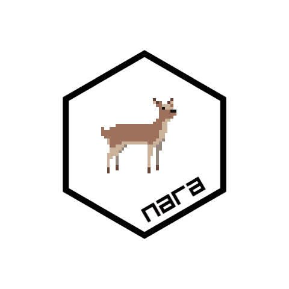
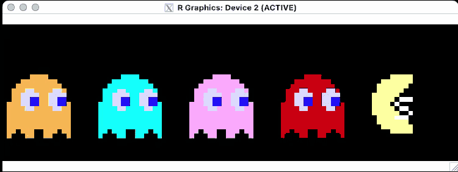
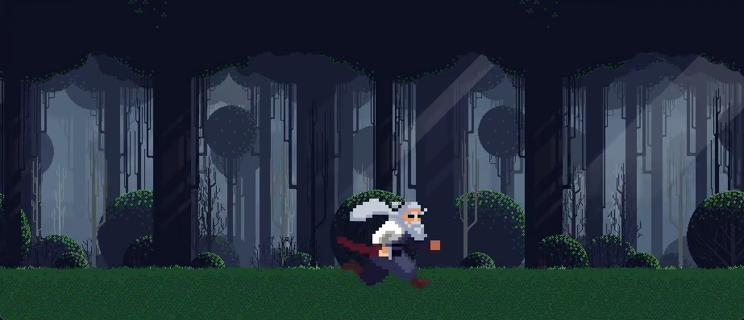
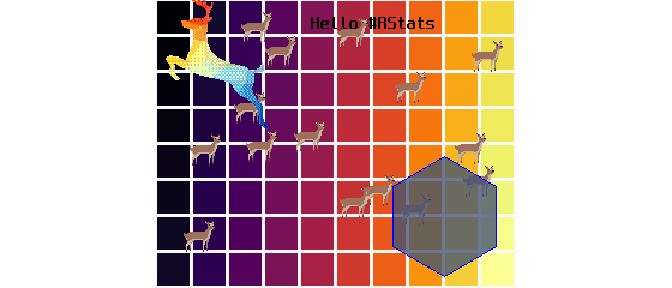
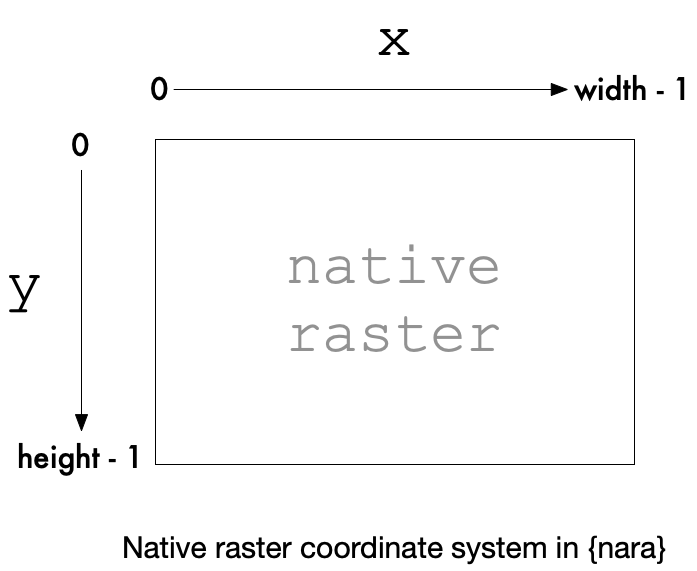

<!-- README.md is generated from README.Rmd. Please edit that file -->

# nara 

<!-- badges: start -->


<!-- [](https://CRAN.R-project.org/package=nara) -->
[](https://github.com/coolbutuseless/nara/actions/workflows/R-CMD-check.yaml)
[](https://CRAN.R-project.org/package=nara)
<!-- badges: end -->

`{nara}` is a package for working with R’s native raster image format.

Native raster images are fast to manipulate and render, and open the
possibility for realtime rendering e.g. games and interactive
applications.

`{nara}`:

- uses C to speed up operations
- uses *in-place* operations to avoid memory allocations.
- renders discrete, non-aliased pixels (internally all coordinates are
  rounded to integer values)
- includes basic drawing primitives e.g. rectangles, lines, circles

### What’s in the box

- Image creation
  - `nr_new()`, `nr_new_from()`
- Conversion
  - `array_to_nr()`, `nr_to_array()`
  - `raster_to_nr()`, `nr_to_raster()`
  - `matrix_to_nr()`
  - `magick_to_nr()`
  - `nrs_to_mp4()`
  - `nrs_to_gif()`
- Drawing
  - `nr_fill()`
  - `nr_rect()`, `nr_circle()`, `nr_polyline()`, `nr_polygon()`, …
  - `nr_tri_coords()`, `nr_tri_mesh()`
- Selection and Combination
  - `nr_copy()`, `nr_copy_into()`
  - `nr_crop()`
  - `nr_blit()`, `nr_blit_multi()`
  - `nr_transpose()`, `nr_rotate()`
  - `nr_resize()`, `nr_scale()`
- Color manipulation
  - `nr_dither()`, `nr_desaturate()`, `nr_threshold()`,
    `nr_color_replace()`
- Sample images
  - `deer` 16 frames of an animated deer character
  - `tileset` and `tileset_config` for demonstrating tile sets and
    `nr_blit_multi()`

Reading and writing native raster images is supported by `{jpeg}`,
`{png}`, and `{fastpng}` packages.

## Installation

You can install from [GitHub](https://github.com/coolbutuseless/nara)
with:

``` r
# install.package('remotes')
remotes::install_github('coolbutuseless/nara')
```

Source/binary versions can also be installed from
[R-universe](https://r-universe.dev)

``` r
install.packages('nara', repos = c('https://coolbutuseless.r-universe.dev', 'https://cloud.r-project.org'))
```

## Sample Images created with `{nara}`

    

#### Animated Forest

Realtime rendering of a
[forest](https://edermunizz.itch.io/free-pixel-art-forest) (made of 11
overlapping parallax layers with alpha blending) with a [samurai
figure](https://xzany.itch.io/samurai-2d-pixel-art) running out front.

General approach used to create this image:

- For each frame
  - stack the 11 layers into a single image
  - *blit* a samurai on top
- At the end of each frame
  - adjust each layer with an offset based upon its depth
    i.e. foreground images move faster than background images
  - Advance to the next samurai frame

<https://github.com/user-attachments/assets/c3daeccc-0d21-4f0d-ba1e-655fd836c9c3>

<figure>

<figcaption aria-hidden="true">Samurai running through
forrest</figcaption>
</figure>

Note: The animated version of the scene above is only visible on the
[github page](https://github.com/coolbutuseless/nara)

## Static Rendering: Example

The following code is a demonstration of some of the different drawing
and blitting commands in `{nara}`

``` r
library(nara)
set.seed(1)

#~~~~~~~~~~~~~~~~~~~~~~~~~~~~~~~~~~~~~~~~~~~~~~~~~~~~~~~~~~~~~~~~~~~~~~~~~~~~~
# Create 'nr' image
#~~~~~~~~~~~~~~~~~~~~~~~~~~~~~~~~~~~~~~~~~~~~~~~~~~~~~~~~~~~~~~~~~~~~~~~~~~~~~
w  <- 10
h  <- 8
nr <- nr_new(w * 30, h * 30, fill = 'grey98')

#~~~~~~~~~~~~~~~~~~~~~~~~~~~~~~~~~~~~~~~~~~~~~~~~~~~~~~~~~~~~~~~~~~~~~~~~~~~~~
# Draw a grid of squares
#~~~~~~~~~~~~~~~~~~~~~~~~~~~~~~~~~~~~~~~~~~~~~~~~~~~~~~~~~~~~~~~~~~~~~~~~~~~~~
colors <- viridisLite::inferno(w * h)
coords  <- expand.grid(y = seq(0, h-1) * 30 + 1, x = seq(0, w-1) * 30 + 1)
nr_rect(nr, x = coords$x, y = coords$y, w = 27, h = 27, fill = colors)

#~~~~~~~~~~~~~~~~~~~~~~~~~~~~~~~~~~~~~~~~~~~~~~~~~~~~~~~~~~~~~~~~~~~~~~~~~~~~~
# Draw a bunch of deer sprites
#~~~~~~~~~~~~~~~~~~~~~~~~~~~~~~~~~~~~~~~~~~~~~~~~~~~~~~~~~~~~~~~~~~~~~~~~~~~~~
nr_blit(dst = nr, src = deer[[1]], 
        x = sample(300, 15), y = sample(200, 15))


#~~~~~~~~~~~~~~~~~~~~~~~~~~~~~~~~~~~~~~~~~~~~~~~~~~~~~~~~~~~~~~~~~~~~~~~~~~~~~
# Add an image read from file (with alpha transparency)
#~~~~~~~~~~~~~~~~~~~~~~~~~~~~~~~~~~~~~~~~~~~~~~~~~~~~~~~~~~~~~~~~~~~~~~~~~~~~~
img <- fastpng::read_png(system.file("image/deer-1.png", package = "nara"), type = 'nativeraster')
img <- nr_scale(img, 0.15)
nr_blit(dst = nr, src = img, x = 50, y = 50)

#~~~~~~~~~~~~~~~~~~~~~~~~~~~~~~~~~~~~~~~~~~~~~~~~~~~~~~~~~~~~~~~~~~~~~~~~~~~~~
# Add a polygon
#~~~~~~~~~~~~~~~~~~~~~~~~~~~~~~~~~~~~~~~~~~~~~~~~~~~~~~~~~~~~~~~~~~~~~~~~~~~~~
thetas <- seq(pi/6, 2*pi, pi/3)
x <- 50 * cos(thetas) + 240
y <- 50 * sin(thetas) + 180
nr_polygon(nr, x = x, y = y, fill = '#556688c0', color = 'blue')

#~~~~~~~~~~~~~~~~~~~~~~~~~~~~~~~~~~~~~~~~~~~~~~~~~~~~~~~~~~~~~~~~~~~~~~~~~~~~~
# Add text to the image
#~~~~~~~~~~~~~~~~~~~~~~~~~~~~~~~~~~~~~~~~~~~~~~~~~~~~~~~~~~~~~~~~~~~~~~~~~~~~~
nr_text_mono(nr, x = 180, y = 20, str = "Hello #RStats", fontsize = 16)

#~~~~~~~~~~~~~~~~~~~~~~~~~~~~~~~~~~~~~~~~~~~~~~~~~~~~~~~~~~~~~~~~~~~~~~~~~~~~~
# Copy image to the device
#~~~~~~~~~~~~~~~~~~~~~~~~~~~~~~~~~~~~~~~~~~~~~~~~~~~~~~~~~~~~~~~~~~~~~~~~~~~~~
plot(nr)
```



#### Dynamic (realtime) Rendering: Animated deer

The reason to use `{nara}` is that operations are fast enough that
native raster images can be used as an *in-memory* buffer for a
double-buffered rendering system.

`Double-buffered` rendering is where two buffers are used for rendering
with one buffer being shown to the user, and the other existing in
memory as a place to render.

In this example, the `deer` sprite is rendered to a larger native raster
image. This *in-memory* buffer is then displayed to the user using
`plot()` (which just wraps a call to `grid.raster()`).

By altering the position and animation frame every time the kind is
shown, smooth animation is possible.

This simple code runs at well over 100 frames-per-second.

It is unlikely your screen will refresh this fast, but it does indicate
that there is plenty of headroom for more complicated computations for
each frame.

``` r
library(grid)

# Setup a fast graphics device that can render quickly
x11(type = 'cairo', antialias = 'none')
dev.control('inhibit')

# Create the in-memory native raster image
nr <- nr_new(100, 32, 'grey80')

# Clear, blit and render => animation!
for (i in -30:110) {
  nr_fill(nr, 'grey80')                    # Clear the native raster image
  sprite_idx <- floor((i/3) %% 5) + 11
  nr_blit(dst = nr, src = deer[[sprite_idx]], x = i, y = 15) # copy deer to the image
  plot(nr)
  Sys.sleep(0.03)                          # Stop animation running too fast.
}
```

#### Live screen recording


## Technical notes

### What is a native raster image and why is it fast?

A native raster image is a built-in datatype in R.

It is an integer matrix where each integer represents the RGBA color at
a single pixel. The 32-bit integer at each location is interpreted
within R to be four color channels (RGBA) represented by 8 bits each.

This way of encoding color information is closer to the internal
representation used by graphics devices, and therefore can be faster to
render and manipulate.

Native rasters do **not** use pre-multiplied alpha.

### In-place operation

`{nara}` is targeted at fast rendering (\>30fps), and tries to minimise
R function calls and memory allocations.

When updating native raster image with this package, changes are done
*in place* on the current image i.e. a new image is **not** created.

### Anti-aliasing/Interpolation

No anti-aliasing is done by the draw methods in this package.

No interpolation is done - `x` and `y` values for drawing coordinates
are always rounded to integers.

### Dimension ordering

All arguments specifying dimensions are in the order **horizontal** then
**vertical** i.e.

- x, y
- width, height
- hjust, vjust

### Coordinate System

The coordinate system for `nara` native raster image has the origin at
the **top left corner** with coordinates `(0, 0)`.

This is equivalent to `{grid}` graphics using `native` units.

It is also how `{magick}` represents image coordinates, as well as the
majority of C graphics libraries.

<figure>

<figcaption aria-hidden="true">coordinate system</figcaption>
</figure>
