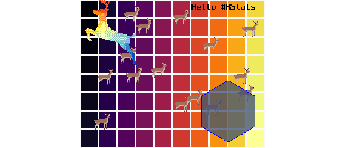
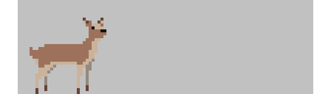

<!-- README.md is generated from README.Rmd. Please edit that file -->

# nara 

<!-- badges: start -->


[](https://github.com/coolbutuseless/nara/actions/workflows/R-CMD-check.yaml)


<!-- badges: end -->

`{nara}` provides tools for working with R’s `nativeRaster` image format
to enable fast graphics rendering.

### Why?

`nativeRaster` buffers are fast enough to use for rendering at speed
\>30 frames-per-second.  
This makes them useful for games and other interactive applications.

# Details

`{nara}`:

- is an *off-screen* rendering buffer.
- is fast to render.
- uses *in-place* operations to avoid memory allocations.
- is focussed on rendering discrete pixels, so all dimensions are
  rounded to integer values prior to rendering.
- includes basic drawing primitives e.g. rectangles, lines, circles

### What is a `nativeRaster` and why is it fast?

A `nativeRaster` is a built-in datatype in R.

It is an integer matrix where each integer represents the RGBA color at
a single pixel. The 32-bit integer at each location is interpreted
within R to be four color channels (RGBA) represented by 8 bits each.

This way of encoding color information is closer to the internal
representation used by graphics devices, and therefore can be faster to
render and manipulate.

Native rasters do **not** use pre-multiplied alpha.

### In-place operation

`{nara}` is targeted at fast rendering (\>30fps), and tries to minimise
R function calls and memory allocations.

When updating `nativeRaster` objects with this package, changes are done
*in place* on the current image i.e. a new image is **not** created.

### Anti-aliasing/Interpolation

No anti-aliasing is done by the draw methods in this package.

No interpolation is done - `x` and `y` values for drawing coordinates
are always rounded to integers.

## Installation

You can install from [GitHub](https://github.com/coolbutuseless/nara)
with:

``` r
# install.package('remotes')
remotes::install_github('coolbutuseless/nara')
```

## Vignettes

- [Creating, transforming, reading, writing nativeRaster
  images](https://coolbutuseless.github.io/package/nara/articles/conversion.html)

## Static Rendering: Example

The following is a rendering of a single scene with multiple elements.

The interesting thing about this scene that drawing all the objects into
the `nativeRaster` image and rendering to screen can take as little as 5
millseconds.

This means that this scene could render at around 200 frames-per-second.

``` r
library(grid)
library(nara)
set.seed(1)

#~~~~~~~~~~~~~~~~~~~~~~~~~~~~~~~~~~~~~~~~~~~~~~~~~~~~~~~~~~~~~~~~~~~~~~~~~~~~~
# Create 'nr' image
#~~~~~~~~~~~~~~~~~~~~~~~~~~~~~~~~~~~~~~~~~~~~~~~~~~~~~~~~~~~~~~~~~~~~~~~~~~~~~
w  <- 10
h  <- 8
nr <- nr_new(w * 30, h * 30, fill = 'grey98')

#~~~~~~~~~~~~~~~~~~~~~~~~~~~~~~~~~~~~~~~~~~~~~~~~~~~~~~~~~~~~~~~~~~~~~~~~~~~~~
# Draw a grid of squares
#~~~~~~~~~~~~~~~~~~~~~~~~~~~~~~~~~~~~~~~~~~~~~~~~~~~~~~~~~~~~~~~~~~~~~~~~~~~~~
colors <- viridisLite::inferno(w * h)
coords  <- expand.grid(y = seq(0, h-1) * 30 + 1, x = seq(0, w-1) * 30 + 1)
nr_rect(nr, x = coords$x, y = coords$y, w = 27, h = 27, fill = colors)

#~~~~~~~~~~~~~~~~~~~~~~~~~~~~~~~~~~~~~~~~~~~~~~~~~~~~~~~~~~~~~~~~~~~~~~~~~~~~~
# Draw a bunch of deer sprites
#~~~~~~~~~~~~~~~~~~~~~~~~~~~~~~~~~~~~~~~~~~~~~~~~~~~~~~~~~~~~~~~~~~~~~~~~~~~~~
nr_blit(dst = nr, src = deer_sprites[[1]], x = sample(300, 15), y = sample(200, 15))


#~~~~~~~~~~~~~~~~~~~~~~~~~~~~~~~~~~~~~~~~~~~~~~~~~~~~~~~~~~~~~~~~~~~~~~~~~~~~~
# Add an image read from file (with alpha transparency)
#~~~~~~~~~~~~~~~~~~~~~~~~~~~~~~~~~~~~~~~~~~~~~~~~~~~~~~~~~~~~~~~~~~~~~~~~~~~~~
img <- png::readPNG(system.file("img", "Rlogo.png", package="png"), native = TRUE)
nr_blit(dst = nr, src = img, x = 0, y = 0)

#~~~~~~~~~~~~~~~~~~~~~~~~~~~~~~~~~~~~~~~~~~~~~~~~~~~~~~~~~~~~~~~~~~~~~~~~~~~~~
# Add a polygon
#~~~~~~~~~~~~~~~~~~~~~~~~~~~~~~~~~~~~~~~~~~~~~~~~~~~~~~~~~~~~~~~~~~~~~~~~~~~~~
thetas <- seq(pi/6, 2*pi, pi/3)
x <- 50 * cos(thetas) + 240
y <- 50 * sin(thetas) + 180
nr_polygon(nr, x = x, y = y, fill = '#556688c0', color = 'blue')

#~~~~~~~~~~~~~~~~~~~~~~~~~~~~~~~~~~~~~~~~~~~~~~~~~~~~~~~~~~~~~~~~~~~~~~~~~~~~~
# Add text to the image
#~~~~~~~~~~~~~~~~~~~~~~~~~~~~~~~~~~~~~~~~~~~~~~~~~~~~~~~~~~~~~~~~~~~~~~~~~~~~~
nr_text_basic(nr, x = 180, y = 20, str = "Hello #RStats", fontsize = 16)

#~~~~~~~~~~~~~~~~~~~~~~~~~~~~~~~~~~~~~~~~~~~~~~~~~~~~~~~~~~~~~~~~~~~~~~~~~~~~~
# Copy image to the device
#~~~~~~~~~~~~~~~~~~~~~~~~~~~~~~~~~~~~~~~~~~~~~~~~~~~~~~~~~~~~~~~~~~~~~~~~~~~~~
grid.raster(nr, interpolate = FALSE)
```



## Static Rendering: Displaying Sprites

Included with `{nara}` are 16 frames of an animated deer character - see
`deer_sprites` data.

#### Blit the first `deer` frame onto a native raster canvas.

``` r
library(grid)

nr <- nr_new(100, 32, 'grey80')
nr_blit(dst = nr, src = deer_sprites[[1]], x = 2, y = 0)
grid.raster(nr, interpolate = FALSE)
```



#### Dynamic (realtime) Rendering: Animated deer

The reason to use `{nara}` is that operations are fast enough that
`nativeRaster` can be used as an *in-memory* buffer for a
double-bufferred rendering system.

`Double-buffered` rendering is where two buffers are used for rendering
with one buffer being shown to the user, and the other existing in
memory as a place to render.

In this example, the `deer` sprite is rendered to a `nativeRaster`
image. This *in-memory* buffer is then displayed to the user using
`grid.raster()`.

By altering the position and animation frame every time the kind is
shown, smooth animation is possible.

This simple code runs at well over 100 frames-per-second.

It is unlikely your screen will refresh this fast, but it does indicate
that there is plenty of headroom for more complicated computations for
each frame.

``` r
library(grid)

# Setup a fast graphics device that can render quickly
x11(type = 'cairo', antialias = 'none')
dev.control('inhibit')

# Create the in-memory nativeRaster canvas
nr <- nr_new(100, 32, 'grey80')

# Clear, blit and render => animation!
for (i in -30:110) {
  nr_fill(nr, 'grey80')                    # Clear the nativeRaster
  sprite_idx <- floor((i/3) %% 5) + 11
  nr_blit(dst = nr, src = deer_sprites[[sprite_idx]], x = i, y = 0) # copy deer to nativeRaster
  dev.hold()
  grid.raster(nr, interpolate = FALSE)     # copy nativeRaster to screen
  dev.flush()
  Sys.sleep(0.03)                          # Stop animation running too fast.
}
```

#### Live screen recording


## Working with multiple sprites

You can quickly *blit* (i.e. copy) a sprite into multiple locations on
the nativeraster with `nr_blit()` and `nr_blit_list()`

In this example 100 random positions and velocities are first created. A
character sprite is then blitted to each of these 100 locations.

The positions are updated using the velocities, and the next frame is
rendered. In this way multiple sprites are rendered and animated on
screen.

``` r
library(grid)

# Setup a fast graphics device that can render quickly
x11(type = 'dbcairo', antialias = 'none', width = 8, height = 6)
dev.control('inhibit')

# Number of sprites
N <- 100

# Canvas size
w <- 400 
h <- 300 

# location and movement vector of all the sprites
x  <- sample(w, N, replace = TRUE)
y  <- sample(h, N, replace = TRUE)
vx <- runif(N, 1, 5)


# Create an empty nativeraster with a grey background
nr <- nr_new(w, h, 'white')


for (frame in 1:1000) {
  # Clear the nativeraster and blit in all the deer
  nr_fill(nr, 'white') 
  deer_idx <- floor((frame/3) %% 5 + 11)
  nr_blit(dst = nr, src = deer_sprites[[deer_idx]], x, y)
  
  # Draw the nativeraster to screen
  dev.hold()
  grid.raster(nr, interpolate = FALSE)
  dev.flush()

  # Update the position of each deer. 
  # Position wraps around
  x <- x + vx
  x <- ifelse(x > w , -32, x)

  # slight pause. Otherwise everything runs too fast!
  Sys.sleep(0.03)
}
```

#### Live screen recording


# Conventions and Terminology

## Dimension ordering

All arguments specifying dimensions are in the order **horizontal** then
**vertical** i.e.

- x, y
- width, height
- hjust, vjust

## Coordinate System

The coordinate system for `nara` nativeRaster objects has its origins at
the **top left corner** of the image with coordinates `(0, 0)`.

This is equivalent to `{grid}` graphics using `native` units.

It is also how `{magick}` represents image coordinates, as well as the
majority of C graphics libraries.

<!--  -->
